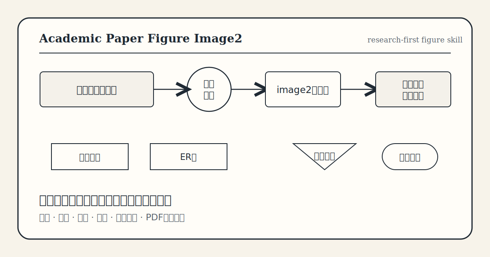

<p align="center">
  
</p>

# Academic Paper Figure Image2

> Research-first image-generation workflow for conservative undergraduate thesis diagrams.

This skill turns messy, missing, or reviewer-unfriendly thesis figures into traditional, textbook-style academic diagrams: data-flow diagrams, ER diagrams, flowcharts, module diagrams, architecture diagrams, and test/process visuals.

It is designed for the situation where a thesis is not failing because the system is absent, but because the figures look like Mermaid/TikZ/dev artifacts, are placed in the wrong chapter, or are simply missing where a conservative reviewer expects them.

## What It Optimizes

- **Passability:** figures match old-school undergraduate software-engineering expectations.
- **Evidence:** figures are derived from thesis claims, source code, system modules, database entities, and test flows.
- **Placement:** each figure belongs to the right chapter and appears near the paragraph it supports.
- **Visual restraint:** black-and-white, textbook-like, no modern SaaS dashboard aesthetics.
- **Replacement discipline:** mock, Mermaid, TikZ, code-generated, cramped, or decorative figures are audited and upgraded.

## Core Workflow

```text
thesis + code + accepted samples
        ↓
figure inventory + missing-figure audit
        ↓
chapter-appropriate diagram plan
        ↓
COSTAR image2 prompt
        ↓
generated academic figure
        ↓
PDF/Word page inspection
```

## Use Cases

| Situation | Skill response |
| --- | --- |
| ER diagram is too simple | Expand into overall ER plus sub-ER diagrams |
| Mermaid/TikZ output looks cramped | Replace with high-resolution conservative academic image |
| Requirements chapter has only prose | Add use-case/business-flow/context DFD |
| Overall design lacks visual proof | Add architecture/module/data-flow diagrams |
| Implementation chapter feels abstract | Add screenshots and operation flowcharts |
| Figure is in the wrong chapter | Move or redraw according to thesis role |

## Repository Map

- [SKILL.md](./SKILL.md): core agent instructions.
- [references/research-audit-workflow.md](./references/research-audit-workflow.md): thesis/code/figure audit workflow.
- [references/prompt-templates.md](./references/prompt-templates.md): reusable image2 prompt templates.
- [references/review-checklist.md](./references/review-checklist.md): final figure review checklist.
- [docs/research-method.md](./docs/research-method.md): research-quality framing.
- [docs/growth-playbook.md](./docs/growth-playbook.md): hacker-growth packaging logic.
- [assets/image2-prompts.md](./assets/image2-prompts.md): visual asset prompts for repo branding.

## Image Generation Note

When working inside a Codex session that exposes a built-in image generation tool, use that tool directly for one-off repo art and thesis figure assets. Do not incorrectly assume the local `imagegen` CLI is the only path.

Use the local CLI only when you specifically need reproducible batch generation, scripted runs, or local API-parameter control. In that case, the CLI may require `OPENAI_API_KEY`.

## Growth Positioning

This repo packages a repeated thesis rescue pattern:

1. reviewer complaint reveals a hidden standard;
2. hidden standard becomes an audit checklist;
3. checklist becomes a repeatable skill;
4. each new thesis improves the prompt library and risk taxonomy.

The growth loop is not "make prettier diagrams". It is "turn reviewer objections into reusable acceptance criteria."

## Install

Use the `.skill` package if available, or copy this folder into your agent skills directory.

```bash
cp -R academic-paper-figure-image2 ~/.agents/skills/
```

## Quality Bar

A generated figure is acceptable only when it is accurate, conventional, readable at A4 thesis width, caption-free inside the image, and placed in the right chapter.

If the diagram looks impressive but a conservative undergraduate thesis reviewer would call it "乱", it fails.
