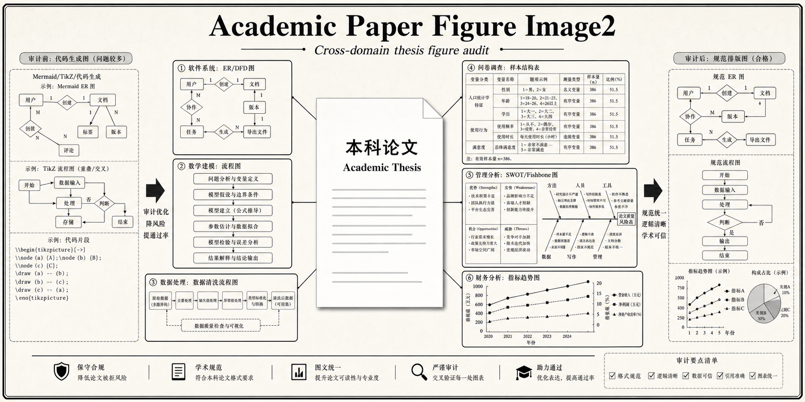

<p align="center">
  
</p>

<p align="center">
  <a href="./README.md"></a>
  <a href="./README.zh-CN.md"></a>
</p>

<p align="center">
  
  
  
  <a href="https://github.com/TsekaLuk/academic-paper-figure-image2/stargazers"></a>
</p>

# Academic Paper Figure Image2

> **Your system may be enough — the figures and their placement are what get you rejected.**
> Research-first image-generation workflow for conservative undergraduate thesis figures.

This skill turns messy, missing, or reviewer-unfriendly thesis figures into traditional, textbook-style academic visuals. It covers software diagrams, mathematical-modeling process figures, data-analysis charts, market-research survey visuals, management diagnosis diagrams, education-research evidence figures, and finance/accounting indicator charts.

It is designed for the situation where a thesis is not failing because the work is absent, but because the expected field materials are missing, misplaced, visually crude, Mermaid/TikZ/dev-like, or inconsistent with conservative undergraduate thesis taste.

> 中文读者请走传送门 → **[简体中文说明](./README.zh-CN.md)**

## What It Optimizes

- **Passability:** figures match old-school undergraduate expectations in the declared field.
- **Domain fit:** figures match the thesis field instead of forcing every paper into software diagrams.
- **Evidence:** figures are derived from thesis claims, source code, data, formulas, questionnaires, case materials, financial statements, screenshots, and test flows.
- **Placement:** each figure belongs to the right chapter and appears near the paragraph it supports.
- **Visual restraint:** textbook-like and print-safe; structural diagrams default to black-and-white, while data visualizations may use restrained academic color when it improves comparison.
- **Replacement discipline:** mock, Mermaid, TikZ, code-generated, cramped, or decorative figures are audited and upgraded.

## Core Workflow

```text
thesis + code + accepted samples
        ↓
figure inventory + missing-figure audit
        ↓
chapter-appropriate diagram plan
        ↓
COSTAR image2 prompt
        ↓
generated academic figure
        ↓
PDF/Word page inspection
```

## Use Cases

| Situation | Skill response |
| --- | --- |
| ER diagram is too simple | Expand into overall ER plus sub-ER diagrams |
| Mermaid/TikZ output looks cramped | Replace with high-resolution conservative academic image |
| Requirements chapter has only prose | Add use-case/business-flow/context DFD |
| Overall design lacks visual proof | Add architecture/module/data-flow diagrams |
| Mathematical-modeling section has formulas only | Add symbol table, model-building flow, validation/sensitivity visuals |
| Data-analysis section has prose-only results | Add cleaning flow, descriptive statistics, correlation/model-evaluation charts |
| Market-research paper lacks survey evidence | Add questionnaire structure, sample profile, reliability/validity, crosstab visuals |
| Management case jumps to suggestions | Add SWOT/PEST/fishbone/process/countermeasure visuals |
| Implementation chapter feels abstract | Add screenshots and operation flowcharts |
| Figure is in the wrong chapter | Move or redraw according to thesis role |

## Repository Map

- [SKILL.md](./SKILL.md): core agent instructions.
- [scripts/audit_figure_assets.py](./scripts/audit_figure_assets.py): reusable asset inventory, SVG font-risk audit, and contact-sheet generator.
- [references/research-audit-workflow.md](./references/research-audit-workflow.md): thesis/code/figure audit workflow.
- [references/cross-domain-figure-playbook.md](./references/cross-domain-figure-playbook.md): cross-field figure and material playbook.
- [references/prompt-templates.md](./references/prompt-templates.md): reusable image2 prompt templates.
- [references/review-checklist.md](./references/review-checklist.md): final figure review checklist.
- [docs/research-method.md](./docs/research-method.md): research-quality framing.
- [docs/growth-playbook.md](./docs/growth-playbook.md): hacker-growth packaging logic.
- [assets/image2-prompts.md](./assets/image2-prompts.md): visual asset prompts for repo branding.

## Image Generation Note

When working inside a Codex session that exposes a built-in image generation tool, use that tool directly for one-off repo art and thesis figure assets. Do not incorrectly assume the local `imagegen` CLI is the only path.

Use the local CLI only when you specifically need reproducible batch generation, scripted runs, or local API-parameter control. In that case, the CLI may require `OPENAI_API_KEY`.

## Font-Safe Figure Editing

If an existing image2 figure already has the correct academic structure and only its typography is wrong, use the image model as an end-to-end **edit of the original figure**. Do not replace it with a Python/Pillow/Matplotlib redraw just to force fonts; that changes the authored image2 asset and can introduce new layout artifacts.

For Jiangsu Ocean University-style Chinese thesis deliverables, the default typography requirement is:

- Chinese text inside body tables, image2 diagrams, and Python advanced visualizations: 五号 `KaiTi_GB2312`.
- English letters, model names, numbers, formulas, and punctuation where appropriate: 五号 `Times New Roman` or an equivalent academic serif.
- Captions stay outside the image and are controlled by the thesis template.

When editing image2 figures, state these constraints directly in the edit prompt: preserve all nodes, arrows, colors, layout, and figure content; change only typography; no caption, figure number, watermark, or decorative additions inside the image.

## Reusable Toolchain

Use the repo as a workflow, not just a prompt library:

```bash
python scripts/audit_figure_assets.py thesis/figures/generated \
  --recursive \
  --out-md /tmp/figure-audit.md \
  --contact-sheet /tmp/figure-contact-sheet.png
```

The audit script produces a figure inventory, dimensions, aspect-ratio warnings, SVG font-risk warnings, and a contact sheet for visual regression. A reliable thesis pass should then back up source assets, classify image2 diagrams versus code charts versus screenshots, edit image2 figures with Codex built-in image tooling, rerender data visualizations from source scripts, rebuild PDF/Word, and inspect final pages rather than trusting isolated image files.

## Growth Positioning

This repo packages a repeated thesis rescue pattern:

1. reviewer complaint reveals a hidden standard;
2. hidden standard becomes an audit checklist;
3. checklist becomes a repeatable skill;
4. each new thesis improves the prompt library and risk taxonomy.

The growth loop is not "make prettier diagrams". It is "turn reviewer objections into reusable acceptance criteria."

## Install

Use the `.skill` package if available, or copy this folder into your agent skills directory.

```bash
cp -R academic-paper-figure-image2 ~/.agents/skills/
```

## Quality Bar

A generated figure is acceptable only when it is accurate, conventional, readable at A4 thesis width, caption-free inside the image, and placed in the right chapter. For data visualizations, color is acceptable when it is restrained, print-safe, and backed by traceable thesis data.

If the diagram looks impressive but a conservative undergraduate thesis reviewer would call it "乱", it fails.

---

<p align="center">
  If this saved you a thesis-review round, a ⭐ helps other students find it.<br>
  <sub><a href="./README.zh-CN.md">简体中文</a> · <a href="./docs/growth-playbook.md">Growth Playbook</a> · <a href="./SKILL.md">SKILL.md</a></sub>
</p>
